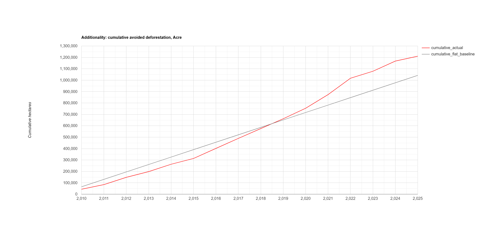
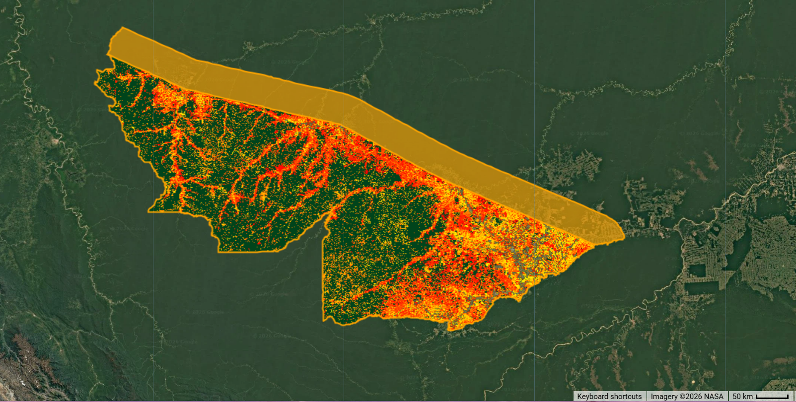

# redd-baseline-explorer
Modeling REDD+ baseline deforestation rates and additionality for a Brazilian Amazon jurisdiction, Acre, using open satellite forest-change data (Hansen GFC)


*Figure 1: Cumulative actual vs. flat-baseline deforestation, Acre, Brazil (2010–2025). Actual cumulative loss exceeds the naive historical-average baseline after ~2020 — see [Limitations](#limitations) for discussion.*

## What this is

An illustrative, open-source exploration of how jurisdictional REDD+ baseline and additionality logic works, applied to Acre, Brazil — home to [SISA (Sistema de Incentivos a Serviços Ambientais)](https://www2.cifor.org/redd-case-book/case-reports/brazil/acres-state-system-incentives-environmental-services-sisa-brazil/), the world's first jurisdictional REDD+ program. It uses public remote sensing data (Hansen Global Forest Change) and open biomass/carbon layers to construct a baseline counterfactual deforestation trajectory, compare it against observed forest loss, estimate avoided emissions, and assess leakage using a simple spatial buffer comparison.

**This is not a reproduction of SISA's actual methodology or Acre's official reference emission level.** It's a simplified, from-scratch illustration of the same conceptual building blocks (historical baselines, additionality, leakage, carbon conversion) that real jurisdictional REDD+ accounting relies on, built entirely from public data.

## Key finding

A simple flat historical-average baseline (2001–2009) does **not** show clean additionality for Acre after ~2020 — cumulative actual deforestation rises above what the naive baseline would have predicted. This most likely reflects the well-documented Amazon-wide deforestation surge of 2019–2022 (linked to reduced federal enforcement over that period) rather than a failure of SISA itself, but it's a genuine result of this simple model, not a flaw hidden after the fact. A trend-adjusted baseline tells a somewhat different story — see the [notebook](notebooks/acre_redd_analysis.ipynb) for both versions side by side. This sensitivity is, in itself, the point: baseline choice is a live methodological debate in REDD+ (VM0007 and successor methodologies), not a settled technical detail.

## Study area


*Figure 2: Hansen Global Forest Change loss-year (2001–2025) for Acre, Brazil, with a 50km leakage-comparison buffer (orange), restricted to Brazilian territory.*

Acre is a state in the western Brazilian Amazon, bordering Peru and Bolivia. SISA/ISA-Carbono, established under State Law 2.308 (2010), applies to the entire state rather than discrete project areas — a "jurisdictional" approach used here to frame the baseline/project period split (pre-2010 vs. post-2010).

## Methodology

1. **Deforestation signal** — Annual forest loss extracted from [Hansen Global Forest Change v1.13](https://developers.google.com/earth-engine/datasets/catalog/UMD_hansen_global_forest_change_2025_v1_13), masked to pixels with ≥30% canopy cover in 2000 (a common REDD+ forest-definition threshold).
2. **Baseline construction** — Two counterfactual models built from the 2001–2009 reference period: a flat historical average, and a linear trend extrapolation. Both are projected forward through the 2010–2025 project period.
3. **Additionality** — Cumulative actual loss compared against both baseline counterfactuals; the gap is the avoided/excess deforestation estimate.
4. **Leakage** — Annual loss inside Acre compared against a 50km buffer zone just outside its border (restricted to Brazilian territory), following the conceptual logic of VM0007's "leakage belt" approach, to check for displacement of deforestation pressure.
5. **Carbon conversion** — Avoided/excess hectares converted to tCO2e using [WHRC pantropical aboveground biomass density](https://developers.google.com/earth-engine/datasets/catalog/WHRC_biomass_tropical), the standard 0.47 carbon fraction, and the 44/12 CO2:C ratio. Actual-emissions estimates use pixel-level biomass at realized loss locations; counterfactual emissions use mean regional biomass density, since no real pixel locations exist for a hypothetical scenario.
6. **Independent check** — Hansen-derived annual loss compared against [INPE's PRODES](https://terrabrasilis.dpi.inpe.br/) official annual deforestation rates for Acre, Brazil's own reported figures for the region.

Full step-by-step detail and all charts are in [`analysis/ANALYSIS.md`](analysis/ANALYSIS.md). The actual implementation is in [`scripts/acre_redd_baseline.js`](scripts/acre_redd_baseline.js), written and run in the Google Earth Engine Code Editor (JavaScript) 

## Repository structure

```
redd-baseline-explorer/
├── README.md
├── REFERENCES.md
├── LICENSE
├── scripts/
│   └── acre_redd_baseline.js       # documented Google Earth Engine script
## Repository structure
 
```
redd-baseline-explorer/
├── README.md
├── REFERENCES.md
├── LICENSE
├── scripts/
│   └── acre_redd_baseline.js       # documented Google Earth Engine script (JavaScript)
├── analysis/
│   └── ANALYSIS.md                 # full write-up: methodology, findings, discussion
├── data/
│   └── exported_csvs/              # annual loss, baseline, buffer tables (from GEE exports)
└── figures/
    ├── additionality_plot.png
    ├── acre_deforestation_pattern.png
    └── acre_vs_buffer_loss.png
```
├── data/
│   └── exported_csvs/              # annual loss, baseline, buffer tables (from GEE exports)
└── figures/
    ├── additionality_plot.png
    └── Capture.png
```

## Reproducing this

The Earth Engine portion requires a free [Google Earth Engine](https://earthengine.google.com/) account. Open the script via the link below, or paste `scripts/acre_redd_baseline.js` into the [Code Editor](https://code.earthengine.google.com/):

- **Live script:** [Get Link URL here](https://code.earthengine.google.com/b7c2dcdefb069838bf5b12023edf46d8)

Running it end-to-end exports the annual loss, baseline, and buffer CSVs to Google Drive, and prints/charts the key results directly in the Code Editor console. The figures in `figures/` and the write-up in `analysis/ANALYSIS.md` were produced from those exports — this is not a one-command reproduction, since the GEE step requires manual execution and export, and there is no Python/notebook pipeline to run afterward.
 
## Limitations

This is a deliberately simplified, illustrative model. Specific known limitations:

- **Forest definition**: the 30% canopy-cover threshold is one defensible choice among several used internationally (national forest definitions reported to the UNFCCC range roughly 10–30%); results would shift somewhat under a different threshold.
- **Static biomass layer**: WHRC's biomass dataset is a single circa-2012 snapshot, not a time series, so all years' carbon conversions assume biomass density hasn't materially changed — a simplification, not a validated assumption.
- **Baseline sensitivity**: flat-average and trend-adjusted baselines produce meaningfully different additionality conclusions, as shown in the key finding above. Neither is presented here as the "correct" answer.
- **Leakage**: assessed via a simple 50km buffer comparison rather than a rigorous, criteria-based leakage belt (VM0007 requires specific reference-region selection criteria this project does not implement).
- **Hansen vs. PRODES divergence**: Hansen's algorithm captures some forest degradation and smaller clearings that PRODES's clear-cut-focused, larger minimum-mapping-unit methodology does not; the two series are expected to diverge for documented, explainable reasons, not because either is "wrong."
- **No uncertainty quantification**: point estimates only; no Monte Carlo or confidence intervals on emission factors or baseline projections.


## Further work

A more rigorous version of this project would include: a statistically matched control-plot or synthetic-control baseline (closer to approaches used by programs like the Family Forest Carbon Program); a full VM0007-compliant leakage belt with proper reference-region criteria; Monte Carlo uncertainty propagation through the carbon conversion step; and direct comparison against Acre's own published reference emission level and reported REDD+ results.

## References

See [`REFERENCES.md`](REFERENCES.md) for full citations (Hansen GFC, PRODES/INPE, WHRC biomass, FAO GAUL, CIFOR's SISA case report, VCS VM0007).

## License

[MIT](LICENSE)
